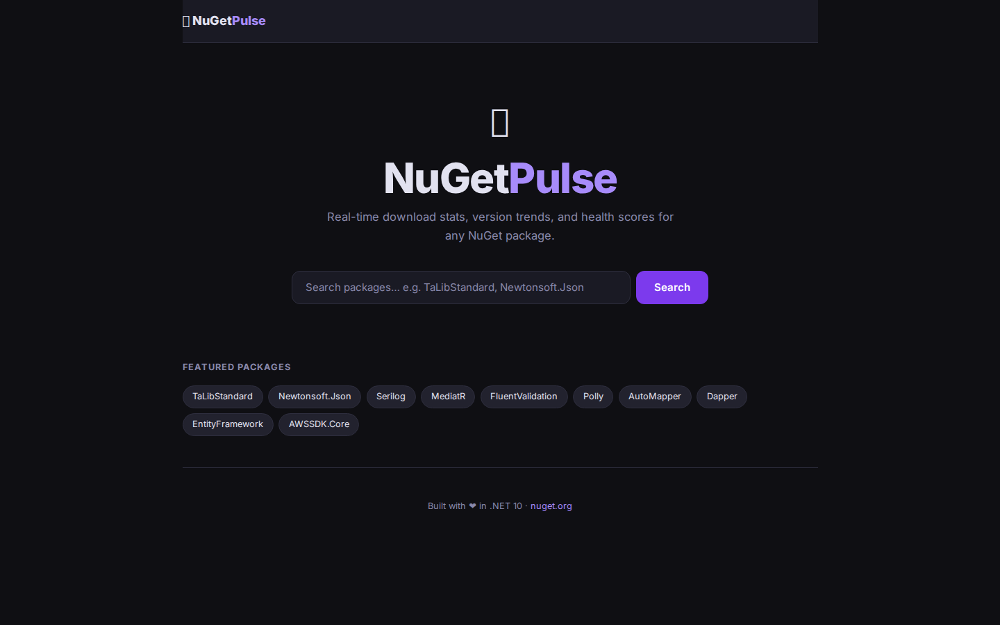

# 📦 NuGetPulse

[](https://github.com/phmatray/NuGetPulse/actions/workflows/ci.yml)
[](LICENSE)
[](https://dotnet.microsoft.com)

**NuGetPulse** is a real-time Blazor Server SaaS dashboard for monitoring the health of your NuGet packages. Track download trends, deprecation warnings, vulnerability alerts, and compute a composite **Health Score (0–100)** across your entire package portfolio — all in a fast, dark-mode-first UI built on .NET 10.

> 🌐 **Live demo:** [https://nugetpulse.garry-ai.cloud](https://nugetpulse.garry-ai.cloud)

---

## Screenshot



---

## Features

- 🔍 **Real-time NuGet API integration** — live metadata from api.nuget.org
- 📊 **Health Score (0–100)** — composite metric: downloads + freshness + vulnerability status + deprecation
- 🌙 **Dark mode** — easy on the eyes during late-night deployments
- ⚡ **Blazor Server** — no JavaScript SPA headaches; SignalR keeps data live
- 🐳 **Docker-ready** — Dockerfile + Kubernetes manifests included
- 🚀 **.NET 10** — taking advantage of the latest performance improvements

---

## Quick Start

### Prerequisites

- [.NET 10 SDK](https://dotnet.microsoft.com/download)
- Git

### Run locally

```bash
git clone https://github.com/phmatray/NuGetPulse.git
cd NuGetPulse
dotnet restore
dotnet run --project src/NuGetPulse.Web
```

Then open [https://localhost:5001](https://localhost:5001) in your browser.

### Docker

```bash
docker build -t nugetpulse .
docker run -p 8080:8080 nugetpulse
```

---

## Project Structure

```
NuGetPulse/
├── src/
│   └── NuGetPulse.Web/          # Blazor Server application
│       ├── Components/
│       │   ├── Pages/
│       │   │   └── PackageDashboard.razor   # Main dashboard page
│       │   └── Layout/
│       ├── Models/
│       │   └── PackageStats.cs  # Health score model
│       └── Services/
│           └── NuGetService.cs  # NuGet API client
├── k8s/                         # Kubernetes manifests
├── Dockerfile
├── global.json
└── Directory.Packages.props     # Central Package Management
```

---

## How the Health Score Works

| Factor | Weight | Description |
|--------|--------|-------------|
| Downloads | 30% | Normalised total download count |
| Freshness | 30% | Days since last publish (< 30 days = 100) |
| Vulnerabilities | 25% | 0 vulns = 100, each vuln –25 |
| Deprecation | 15% | Not deprecated = 100, deprecated = 0 |

**Score ≥ 80** → 🟢 Healthy  
**Score 60–79** → 🟡 Warning  
**Score < 60** → 🔴 Critical

---

## Roadmap

- [ ] Multi-package portfolio view (watchlist)
- [ ] Email/Slack alerts on score drops
- [ ] Historical trend charts
- [ ] GitHub Actions integration (block PRs on unhealthy deps)
- [ ] NuGet private feed support (Azure Artifacts, GitHub Packages)

---

## Contributing

Pull requests are welcome. For major changes, please open an issue first.

---

## License

[MIT](LICENSE) © 2026 [Philippe Matray](https://github.com/phmatray) / [Atypical Consulting](https://atypical.garry-ai.cloud)
